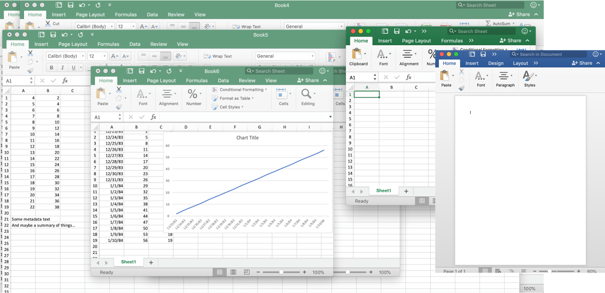
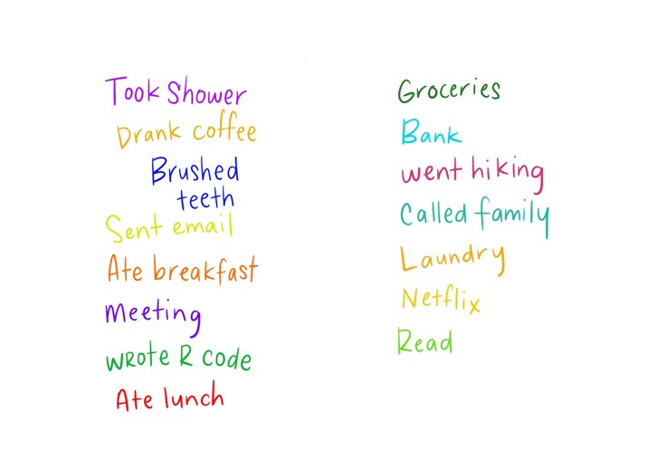
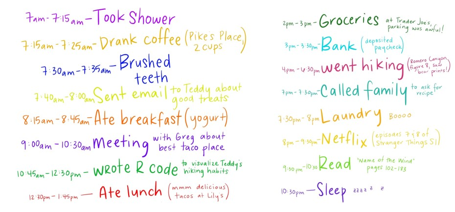
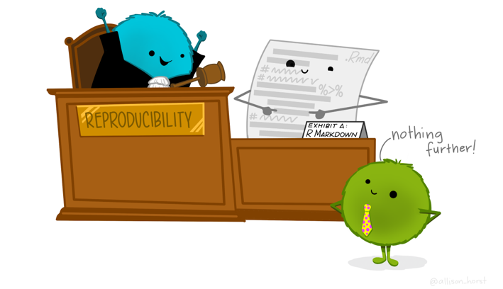
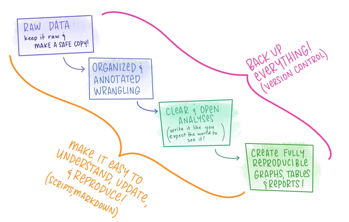
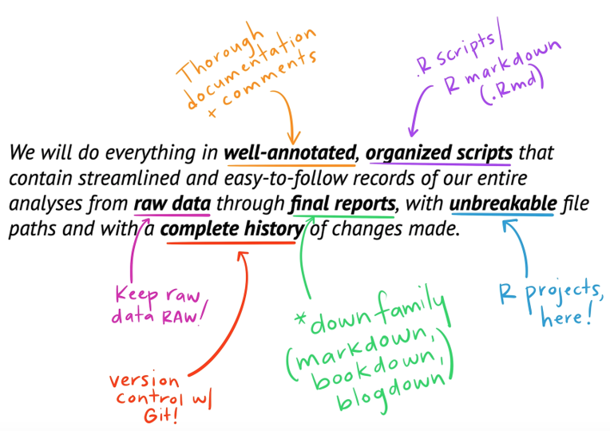
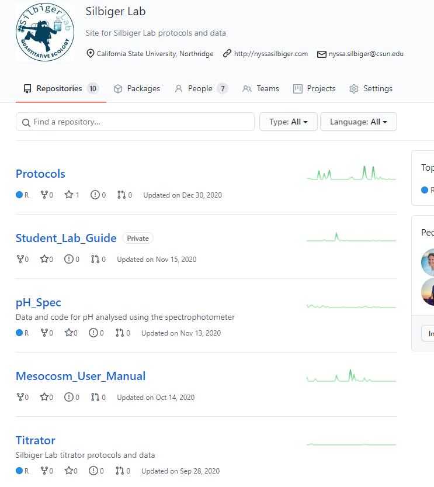
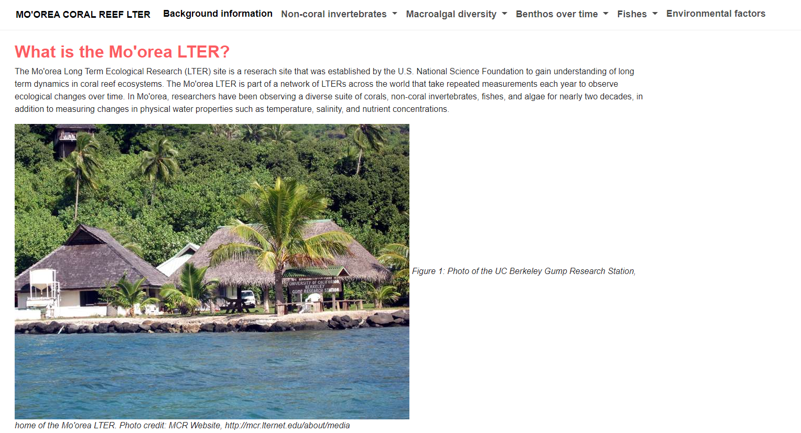
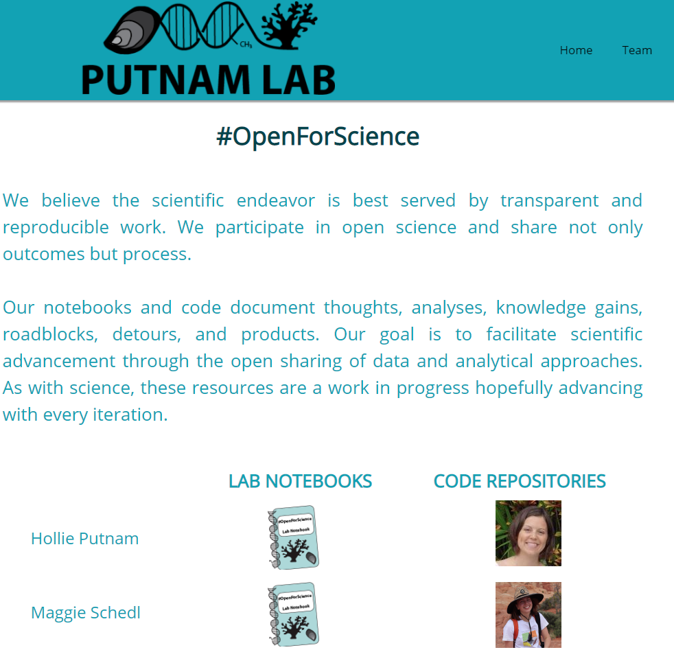
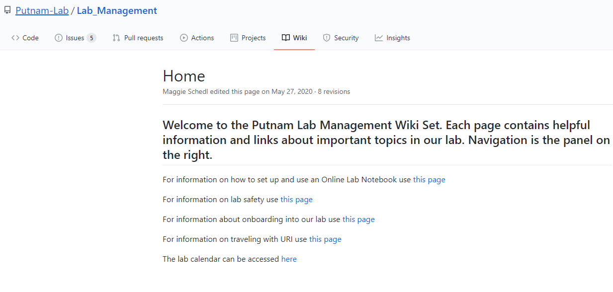

```{r setup, include=FALSE}
options(htmltools.dir.version = FALSE)
```

---
# Outline of discussion

1. A little about me

1. Open and reproducible science

1. Open data science tools for coral reefs
 
1. Using Art to communicate science

1. How can we better merge data science with coral reef conservation?

.center[

]

---
# Me! Dr. Nyssa Silbiger 
## Marine Ecologist, teacher, Rstats nerd...

.pull-left[  
]

.pull-right[  
  
]

---
# Me! Dr. Nyssa Silbiger 
## Marine Ecologist, teacher, Rstats nerd...

My research is focused on better understanding how anthropogenic stressors interact with the natural variability of the oceans and affect individual to ecosystem-level processes. 

.center[

]


---
## Open and reproducbile data science for coral reefs

.center[
*I firmly believe that an important step towards protecting coral reefs is to uphold reproducible data science practices and to share resources.*

]


---

# Reproducibility - what is it?

--
 
### “U.S. National Science Foundation (NSF) subcommittee on replicability in science: ‘reproducibility refers to the **ability of a researcher to duplicate the results of a prior study using the same materials as were used by the original investigator.'**”

.center[
 
]
.foot.note[Goodman et al., Science Translational Medicine  01 Jun 2016:
Vol. 8, Issue 341, pp. 341ps12
DOI: 10.1126/scitranslmed.aaf5027 
]

---
# We are in a reproducibility crisis in science
.center[

]
.foot-note[Monya Baker (2016). 1500 scientists lift the lid on reproducibility. Nature 533 (7604).
]

---

# Types of reproducibility

.foot-note[From Victoria Stodden (as summarized in the ROpenSci Reproducibility Guide)] 

“**Computational reproducibility**: when detailed information is provided about code, software, hardware and implementation details.”

--

“**Empirical reproducibility**: when detailed information is provided about non-computational empirical scientific experiments and observations. In practise this is enabled by making data freely available, as well as details of how the data was collected.”

--

“**Statistical reproducibility**: when detailed information is provided about the choice of statistical tests, model parameters, threshold values, etc. This mostly relates to pre-registration of study design to prevent p-value hacking and other manipulations.”

---
# Is this how you have been working?

 ### If so, that's ok! Let's learn together.
 
 
 

---
# What about this workflow makes it hard to reproduce?

 
 
 
---
# A few areas for improvement

--

- No clear or organized history of what’s been done to the data from raw data through final figures/results  

--

- Lack of comments/annotation describing the steps  

--

- Tedious & time consuming for a collaborator to recreate the analyses 

--

- Backed up w/version control? Probably not…  

--

- How do we transfer this into a final report or presentation? Is that reproducible?  


---
# Why does this matter?

Say I’ve been **arrested for a murder** that was committed 6 months ago. My attorney says its very important to remember exactly what I did on the day of the murder to establish an alibi. I try my best to remember, and come up with this diagram describing my day: 

.center[

]
.footnote[ modified from A Horst]


---

## My attorney is like “bummer...” 

.center[

]  


---

## I wrack my brain and come up with this order of things:

.center[
{width=30%}
]

.foot-note[Still not great...]

.pull-right[.footnote[ modified from A Horst]]


---


## But then! I remember I had a datebook with all this information...



 .center[]


---
# Do your **Data Sci** like it is going to need an **alibi**.


.pull-right[.footnote[ modified from A Horst]]


---
# With data that looks something like...

 
 .pull-right[.footnote[ modified from A Horst]]


---
# Our goals for reproducible science




---


# Why open science is best science
.center[

]


---
# Open Science

.center[
### *"Open science is not just about improving the way we share data and methods; it is also about improving the way we think, work and interact with each other. It’s about technology enabling social infrastructure that can promote inclusivity to create kinder science."*]

.foot-note[[Open Software Means Kinder Science. By Julia Stewart Lowndes on December 10, 2019](https://blogs.scientificamerican.com/observations/open-software-means-kinder-science/)]

---

# Open Science

## One scientist can only do so much  
- More data = more Power

--

## Science must be reproducible  

--

## Who paid for this data collection? 
- If on federal or state grant then the tax payers paid for your data  

--

## "Better and kinder science, done in less time and done together." - Julie Lowndes


---
# Why some people are scared....

.pull-left[
]

.pull-right[
]

.center[Work together, advance science, and don't waste time and money]

---

# Examples of #OpenScience in my lab

[Silbiger Lab Github](https://github.com/silbigerlab)

{width=50%}
---
# Examples of coral reef data science

### Mo'orea Long Term Ecological Research Site

.center[

]

---
# Examples of coral reef data science

- **16 years of ecological data** on coral/macroalgal cover, invertebrate counts, environmental conditions, etc.  


.pull-left[]  

.pull-right[]

---
# Open science in Moorea

- Cool shiny app made using RStats to *tidy* and visualize data (by student Julianna Arenzi from UC Santa Barbara)  
[https://juliannarenzi.shinyapps.io/MCR_LTER_explore/](https://juliannarenzi.shinyapps.io/MCR_LTER_explore/)


---
# Jupyter Lab notebooks for molecular data

.center[
[Putnam Lab](http://putnamlab.com/resources)


]

---
# Great Wiki for creating your own open lab notebook

[https://github.com/Putnam-Lab/Lab_Management/wiki](https://github.com/Putnam-Lab/Lab_Management/wiki)


---
.center[
## *Share data and code to advance coral reef research*

]

---
# Merging art and science for coral reefs

.center[
## Future Pacific


]

---
# Future Pacific 


---
<iframe width="560" height="315" src="https://www.youtube.com/embed/mDFs5wA_9Uw" title="YouTube video player" frameborder="0" allow="accelerometer; autoplay; clipboard-write; encrypted-media; gyroscope; picture-in-picture" allowfullscreen></iframe>


---
# Using AR to bring Future Pacific to you

The the art installation was temporary, but data live on forever.

<video width="800" height="600" src="libs/Images/GoRecord5-20-2021.mov" controls ></video>

---
# Closing night is tomorrow in Miami

<video width="800" height="600" src="libs/Images/IMG-6344.mov" controls ></video>
---
### How can we use our knowledge of coding, open science, and broader outreach to protect coral reefs?

.center[
Breakout! Discuss ideas with your group for advancing these data science tools and share with us.


]
---
# Any questions?

email: Nyssa.silbiger@csun.edu  
twitter: @nsilbiger  
instagram: @silbigerlab_csun  


---
class: center, middle

# Thanks!

Slides created via the R package [**xaringan**](https://github.com/yihui/xaringan).

Some slides modified from Allison Horst, Jarret Byrnes


